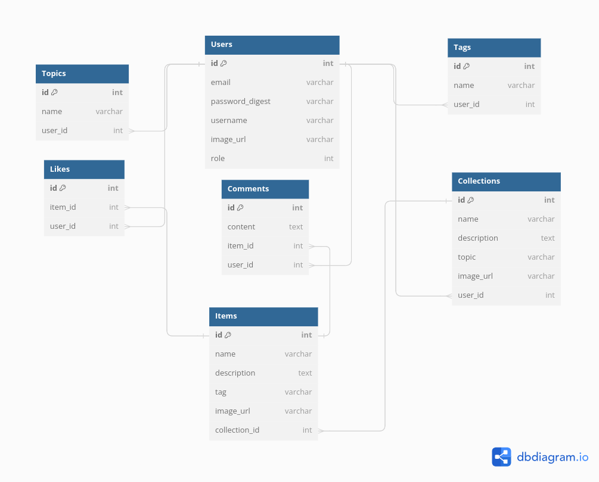

# Personal Collection Management Web Application

## Overview

This is a Ruby on Rails web application designed for managing personal collections such as books, post-stamps, coins, etc. The application provides features for authenticated users to create, view, and manage their collections and items. Non-authenticated users have read-only access, allowing them to search and view collections and items.

## Features

### Authentication and Authorization
- Users can register and authenticate via site forms.
- Non-authenticated users have read-only access.
- Authenticated users can access all features except admin functionalities.
- Admin users can manage users (view, block, unblock, delete), including granting or revoking admin access.

### Collections and Items
- Users can create, edit, and delete collections.
- Each collection contains name, description, topic/category, optional image, and customizable fields for items.
- Users can add, edit, and delete items within their collections.
- Items have fixed fields (id, name, tags) and customizable fields selected by the user.

### Full-Text Search
- The application supports full-text search across items.
- Search results display links to items containing the searched text.

### Comments and Likes
- Users can leave comments on items.
- Comments are linear and displayed chronologically.
- Users can like and dislike items.

### Main Page
- Displays the list of latest items, top 5 largest collections, and a tag cloud.
- Clicking on a tag in the tag cloud displays the list of items associated with that tag.

### Localization and Theming
- Users can select their preferred language (English and one other) and theme (light or dark).
- User preferences are saved for future visits.

## Database Design

The database schema includes the following tables:

1. **users**: Stores user information including email, password, username, role, preferences, and blocked status.
2. **collections**: Stores information about collections including name, description, topic/category, image URL, and user ID.
3. **items**: Stores information about items including name, tags, additional customizable fields, and collection ID.
4. **comments**: Stores comments made by users on items, along with item and user IDs.
5. **likes**: Stores likes made by users on items, along with item and user IDs.
6. **dislikes**: Stores dislikes made by users on items, along with item and user IDs.

## Technologies and Tools

- Ruby on Rails framework
- Database management system (e.g., PostgreSQL, MySQL)
- Devise for authentication
- Bootstrap or similar CSS framework for styling
- Elasticsearch or native database features for full-text search
- Internationalization (I18n) for supporting multiple languages
- GitHub for version control

## Optional Features

- Authentication via social networks
- Custom fields with predefined options
- Export collections to CSV file

